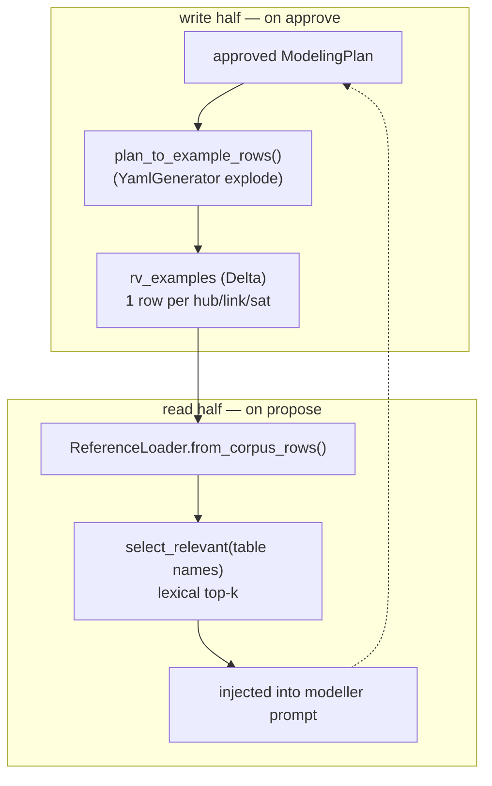
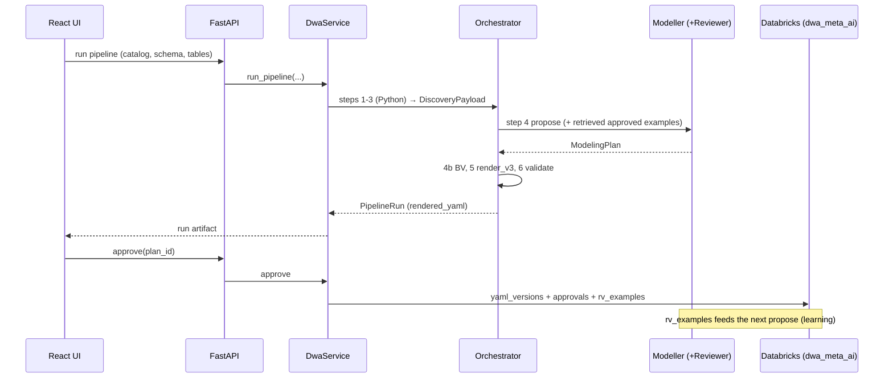

# AI Layer — Architecture

Scope: **only** the AI layer (`dbt_builder/src/ai/`) — the metadata-generation
pipeline, its agents, the feedback-learning loop, storage, and evaluation. The
whole-project view (metadata / dbt_builder / dbt_runner, DV2 layers, roadmap)
lives in [`architecture.md`](architecture.md); this document does not repeat it.

---

## 1. Purpose

Turn a **source-system schema** (tables + columns) into an approved, governed
**Data Vault 2.0 metadata YAML** that the dbt builder consumes — with:

- **deterministic Python everywhere it can be**, LLMs only where judgement is
  required (entity modelling, business-vault reasoning, plan review);
- a **human approval gate** that is also a **learning signal**: approved models
  are fed back as few-shot examples so the modeller improves over time;
- **typed contracts** on every step boundary (frozen Pydantic), so a refactor
  inside one step cannot silently break another.

---

## 2. Package map

```
dbt_builder/src/ai/
├── contracts/      typed step-boundary models (payloads, decisions, bv,
│                   catalog, validation, approval, pipeline_run, supervision)
├── discovery/      source schema → DiscoveryPayload (yaml / spark / profiler)
├── pipeline/       deterministic steps: catalog_inspector, bronze_reader,
│                   diff_analyzer, snapshot_helpers
├── agents/         modeller, plan_reviewer, schema_analyzer, bv_architect,
│                   bv_sat_proposer, yaml_generator, tool_loop
├── reference/      approved-YAML few-shot loader (lexical retrieval)
├── rendering/      yaml_emitter, metadata_v3_emitter (monolithic v3 output),
│                   databricks_defaults
├── validation/     dbt_gate + referential/structural validator
├── supervision/    risk supervisor (pause recommendations)
├── orchestration/  PipelineOrchestrator — wires the six steps
├── store/          approval / yaml / example (corpus) stores + factories +
│                   executor (Databricks SQL, PAT or Entra)
├── evaluation/     conformance, coverage, blast-radius, gold, experiment, CLI
├── service/        DwaService — the ONLY surface the API/UI may import
└── settings.py     AISettings (env-driven, DWA_AI_* prefix)
```

**Boundary rule (enforced by `tests/ai/test_architecture.py`):** the API/UI may
import only `ai.service` + `ai.contracts`; nothing may import the deprecated
`ai.embeddings`.

---

## 3. The pipeline (six steps)

```mermaid
graph LR
    D["Discovery<br/>(schema → DiscoveryPayload)"]
    S1["1. Catalog Inspector<br/>(Python)"]
    S2["2. Bronze Reader<br/>(Python)"]
    S3["3. Diff Analyzer<br/>(Python)"]
    S4["4. Modeller<br/>(LLM)"]
    R["4a. Plan Reviewer<br/>(LLM, 2nd model)"]
    S4b["4b. BV Architect<br/>(+ BV Sat Proposer LLM)"]
    S5["5. YAML Generator / v3 Emitter<br/>(deterministic)"]
    S6["6. Validator<br/>(Python + dbt gate)"]
    A["Approval gate<br/>(human)"]

    D --> S1 --> S2 --> S3 --> S4 --> R --> S4b --> S5 --> S6 --> A
```



- **Steps 1–3, 5, 6 are deterministic Python.** Steps 4 / 4a / 4b are LLM.
- **Step 4 (Modeller)** consumes a `DiscoveryPayload`, proposes a `ModelingPlan`
  (hubs/links/satellites) via sampled completions + majority vote, with tolerant
  JSON coercion, table batching, and a process-global TPM/RPM rate limiter.
- **Step 4a (Plan Reviewer)** is a second, stronger model that critiques/patches
  the plan (two-model flow: generator + reviewer).
- **Step 4b (BV Architect + BV Sat Proposer)** derives business-vault artefacts.
- **Step 5** renders output two ways (see §6).
- **Step 6** validates: YAML syntax → Pydantic → referential integrity →
  optional `dbt parse`/compile (the **dbt gate**). Nothing ERROR-severity is
  approvable.

---

## 4. Contracts (typed boundaries)

| Contract | Role |
|---|---|
| `DiscoveryPayload` (`payloads.py`) | source system + tables + columns (+ profiles) — the modeller input |
| `ModelingPlan` (`decisions.py`) | hubs / links / satellites with cross-entity invariants (unique names, sat parent exists, per-hub sat cap) |
| `BvProposal` (`bv.py`) | PIT / bridge / bv-sat proposals |
| `ValidationReport` (`validation.py`) | issues + pass/fail; gates approval |
| `ApprovalRecord` (`approval.py`) | insert-only audit row (DRAFT/APPROVED/REJECTED/CHANGES_REQUESTED) |
| `PipelineRun` (`pipeline_run.py`) | run artifact the UI polls |

All are `frozen=True, extra="forbid"` — safe to hash/cache/thread and immune to
field drift.

---

## 5. Feedback-learning loop (the differentiator)

Approved models teach the modeller. Two halves, closed automatically on approve:



- **Retrieval is lexical** (token overlap on names), **deterministic**, and
  gated by `learning_examples_enabled` (default off → prompt byte-identical to
  the pre-learning agent). This is also the **ablation switch**.
- Chosen over a vector DB deliberately: tiny human-gated corpus, identifier (not
  prose) queries, determinism (snapshot tests), zero standing infra. The
  synonymy gap (e.g. German/English naming) is handled by a small alias map, not
  embeddings, unless a measured recall miss justifies the upgrade.

---

## 6. Rendering — two representations of the same plan

| Output | Shape | Emitter | Stored in |
|---|---|---|---|
| **v3 monolithic** (`iec_cim_metadata_v3.yaml` format) | ONE document for the whole system | `metadata_v3_emitter.render_v3` | `yaml_versions` |
| **Per-object dbt YAMLs** (`hub_*.yml`, …) | one file per object | `YamlGenerator` (also the corpus exploder) | `rv_examples` |

`render_v3` produces the `rendered_yaml` stored on approval; `YamlGenerator`
produces the per-object files the reference loader parses. Same plan, two views —
they never drift because the corpus stores exactly what the loader parses.

---

## 7. Storage layer (Databricks Delta, Entra auth)

Three Delta tables in `edh_platform_config_dev.dwa_meta_ai` (created lazily on
first store construction; schema auto-created):

| Table | Written by | Content |
|---|---|---|
| `yaml_versions` | `DeltaYamlStore` | approved v3 YAML, versioned per catalog |
| `approvals` | `DeltaApprovalStore` | insert-only approval audit trail |
| `rv_examples` | `DeltaExampleStore` | per-object learning corpus |

- **Backend selection** (`metadata_store_backend`): `auto` → Delta if creds
  present, else ADLS, else local; or force `delta`/`adls`/`local`. Local/CI use
  filesystem + SQLite so tests never touch Databricks (autouse conftest guard).
- **Executor** (`store/executor.py`, `utils/databricks_sql.py`): one shared
  `make_databricks_executor` builds a SQL-Warehouse connection. Auth is **PAT**
  or **Azure AD / Entra** (`databricks_auth_type=azure-cli`) — the latter for
  PAT-disabled workspaces; the token is fetched per request via azure-identity
  so it auto-refreshes.
- Store/corpus writes on approve are wrapped so a Databricks failure never
  blocks approval.

---

## 8. Validation & approval gate

- **Validator** (`validation/__init__.py`): YAML → Pydantic → referential rules
  (orphan sat, undeclared hashdiff, system column in payload, appendOnly rules,
  on_schema_change) → optional **dbt gate** (`dbt_gate.py`, `dbt parse`/compile
  against AutomateDV).
- **Approval gate** (`DwaService.approve`): blocks any plan with ERROR-severity
  issues; on success persists v3 YAML + explodes the plan into the corpus +
  writes the audit row.

---

## 9. Evaluation & experiments (thesis)

`evaluation/` — ground-truth-free + gold-based quality metrics over a
`ModelingPlan` (details in
[`../../thesis/experiments-and-evaluation.md`](../../thesis/experiments-and-evaluation.md)):

| Module | Metric |
|---|---|
| `conformance.py` | DV2 convention score + typed error taxonomy |
| `coverage.py` | input (source tables) → output (objects) completeness |
| `blast_radius.py` | downstream fan-out per object; weighted error impact |
| `gold.py` | precision/recall/F1 + business-key accuracy vs `gold_sets/*.yml` |
| `experiment.py` | `evaluate_plan` bundle + `run_ablation` (OFF vs ON, learning curve) + latency |
| `__main__.py` | CLI: `score` (one plan) and `ablation` (the study) |

CLI: `python -m dbt_builder.src.ai.evaluation score --plan p.json --gold IEC_CIM_001`.

---

## 10. Configuration (`settings.py`)

`AISettings` (pydantic-settings, env prefix `DWA_AI_`, `.env` at repo root).
Key groups: Azure OpenAI (endpoint/key/deployments), modeller tuning (token
budgets, batching, sample parallelism, TPM), plan-review + bv toggles, the
**metadata store** (backend, Databricks creds + `databricks_auth_type`, Delta
catalog/schema/table names), and **feedback learning**
(`learning_examples_enabled`, `learning_examples_k`).

---

## 11. Service facade & API boundary

`DwaService` (`service/__init__.py`) is the single entry point the FastAPI
routers and tests use. It composes the deterministic steps, the LLM agents, the
validator, the approval gate, and the three stores. The React UI talks only to
FastAPI, which talks only to `DwaService` — so `ai/*` internals can be
refactored freely without touching the UI.

---

## 12. End-to-end data flow


