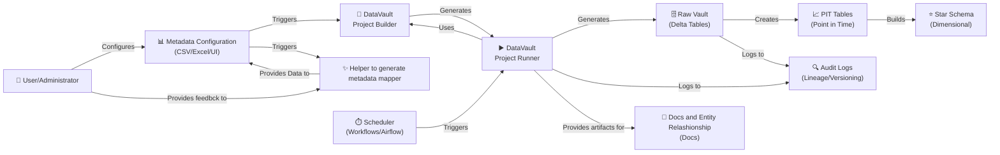
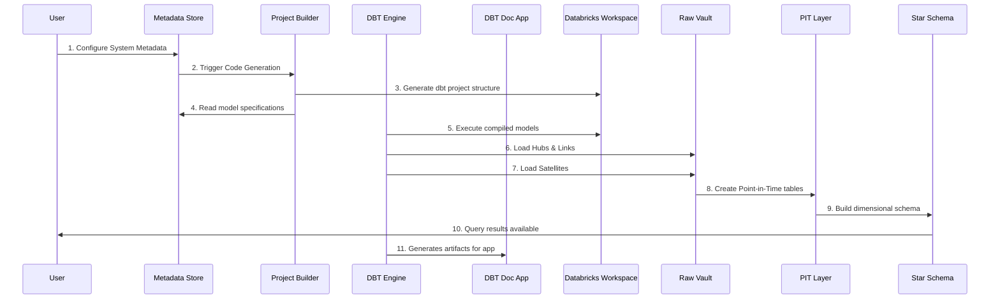
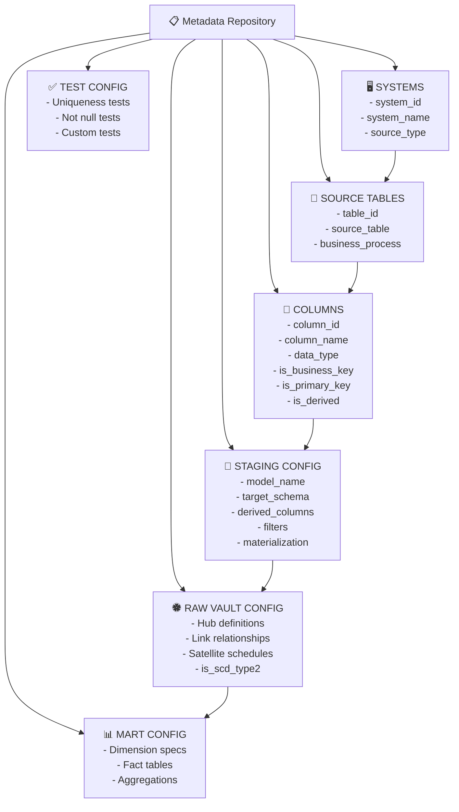
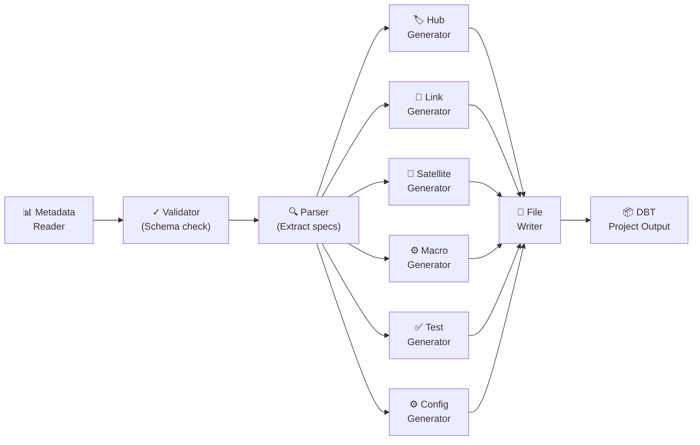
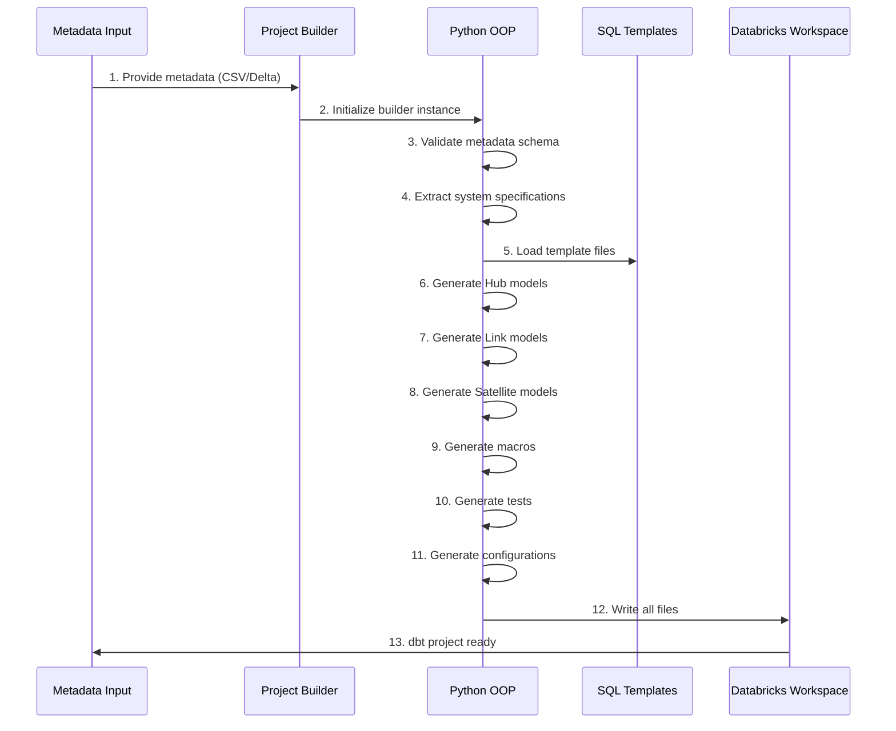
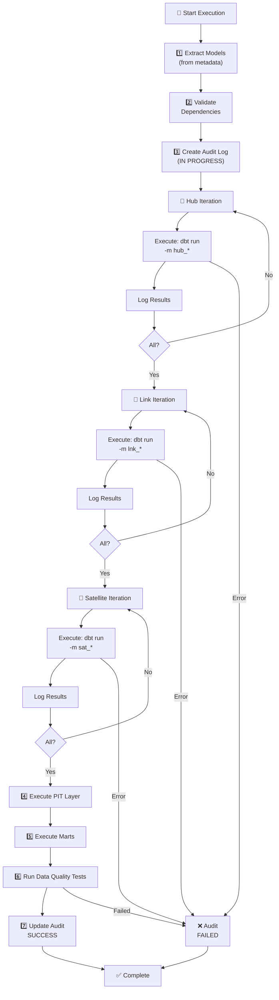
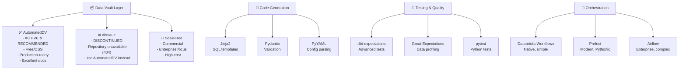
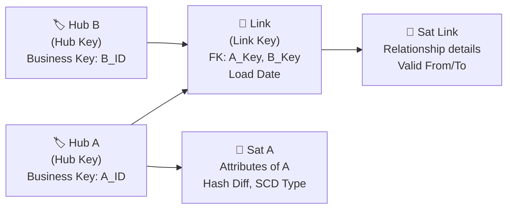

# Data Warehouse Automation (DWA) - Architecture

## Table of Contents

- [Purpose & Objectives](#1-purpose--objectives)
    - [Key Constraints & Patterns](#key-constraints--patterns)
- [High-Level Architecture](#2-high-level-architecture)
    - [System Overview Diagram](#21-system-overview-diagram)
    - [Data Flow Pipeline](#22-data-flow-pipeline)
- [Project Folder Structure](#3-project-folder-structure)
- [Core Components](#4-core-components)
    - [Metadata Configuration](#41-metadata-configuration)
    - [Metadata Structure Diagram](#metadata-structure-diagram)
    - [Key Metadata Components](#key-metadata-components)
    - [DataVault Project Builder](#42-datavault-project-builder)
    - [Builder Architecture](#builder-architecture)
    - [Core Responsibilities](#core-responsibilities)
    - [Process Flow](#process-flow)
    - [Macro Examples](#macro-examples)
    - [DataVault Project Runner](#43-datavault-project-runner)
    - [Execution Flow](#execution-flow)
    - [Runner Responsibilities](#runner-responsibilities)
    - [Audit Logging Strategy](#audit-logging-strategy-recommended)
- [Recommended Supporting Libraries & Tools](#5-recommended-supporting-libraries--tools)
    - [Core Data Vault Framework](#51-core-data-vault-framework)
    - [Supporting DBT Packages](#52-supporting-dbt-packages)
    - [Python Libraries for Project Builder](#53-python-libraries-for-project-builder)
    - [Library Recommendation Matrix](#54-library-recommendation-matrix)
    - [Installation Reference](#55-installation-reference)
- [Architecture Patterns](#6-architecture-patterns)
    - [Data Vault 2.0 Layers](#61-data-vault-20-layers)
    - [Hub-Link-Satellite Relationships](#62-hub-link-satellite-relationships)
- [Implementation Roadmap](#7-implementation-roadmap)
- [Technology Stack Summary](#8-technology-stack-summary)
- [Best Practices & Recommendations](#9-best-practices--recommendations)
- [References & Resources](#10-references--resources)

---

## 1. Purpose & Objectives
### Purpose
The DWA system is designed to:
- **Automate Data Warehouse construction** using DBT framework with Data Vault 2.0 and Star Schema patterns
- **Dynamic code generation** based on metadata configuration
- **Multi-system support** with independent system deployments
- **Object-Oriented Python design** for maintainability and extensibility
- **DBT best practices** integration while preserving lineage and documentation capabilities
- **Scalability** for various data sources and transformation complexity levels

### Key Constraints & Patterns:
- Preserve DBT native features: data lineage graphs and documentation
- If needed, implement alternatives using Python/Databricks for enhanced functionality
- Support orchestration through schedulers (Databricks Workflows, Airflow, etc.)

---

## 2. High-Level Architecture

### 2.1 System Overview Diagram



### 2.2 Data Flow Pipeline



---

## 3. Project Folder Structure

The project is organized into three independent subprojects that correspond to the main DWA components:
- `metadata` — metadata ingestion, validation, and metadata-driven model definitions
- `dbt_builder` — DBT project generation and template management
- `dbt_runner` — DBT execution, orchestration, and audit logging

Shared code is placed in a `shared/` package and consumed by all three subprojects.
Each subproject has its own `devops/` folder so it can be deployed independently, while the shared folder is included by all deploys.

```text
project_root/
├── metadata/
│   ├── src/                  # Metadata ingestion and configuration code
│   ├── tests/                # Unit/integration tests for metadata logic
│   ├── devops/               # CI/CD and deployment artifacts for metadata service
│   │   ├── azure-pipelines.yml
│   │   ├── deploy.sh
│   │   └── README.md
│   ├── README.md             # Component-specific usage and deployment notes
│   └── pyproject.toml        # Optional component packaging config
│
├── dbt_builder/
│   ├── src/                  # DBT generation engine and template logic
│   ├── tests/                # Unit/integration tests for builder logic
│   ├── devops/               # CI/CD and deployment artifacts for dbt_builder
│   │   ├── azure-pipelines.yml
│   │   ├── deploy.sh
│   │   └── README.md
│   ├── README.md
│   └── pyproject.toml
│
├── dbt_runner/
│   ├── src/                  # DBT execution orchestration and audit runtime
│   ├── tests/                # Unit/integration tests for runner logic
│   ├── devops/               # CI/CD and deployment artifacts for dbt_runner
│   │   ├── azure-pipelines.yml
│   │   ├── deploy.sh
│   │   └── README.md
│   ├── README.md
│   └── pyproject.toml
│
├── shared/
│   ├── src/                  # Reusable utilities, helpers, and common libraries
│   ├── tests/                # Shared tests for common functionality
│   └── README.md             # Shared usage and packaging notes
│
├── devops/                   # Top-level deployment orchestration and reusable templates
│   ├── metadata/
│   │   ├── pipeline.yml
│   │   └── deploy.sh
│   ├── dbt_builder/
│   │   ├── pipeline.yml
│   │   └── deploy.sh
│   ├── dbt_runner/
│   │   ├── pipeline.yml
│   │   └── deploy.sh
│   ├── shared/               # Shared deployment scripts and conventions
│   │   └── deploy_common.sh
│   └── templates/            # Reusable CI/CD pipeline templates
│       └── build-and-deploy.yml
│
├── docs/                     # Architecture docs, run guides, and diagrams
├── README.md
└── pyproject.toml            # Optional top-level packaging / tooling config
```

### Folder structure notes
- `metadata/`, `dbt_builder/`, and `dbt_runner/` are independent subprojects and can each be deployed separately.
- `shared/` contains common code, utilities, and tests used by all three subprojects.
- Each subproject has a `devops/` folder for its own deployment pipeline and release definition.
- A top-level `devops/` folder contains reusable templates and shared deployment helpers that can be referenced by each component pipeline.
- `docs/` holds documentation such as architecture, run guides, and deployment instructions.

---

## 4. Core Components

### 4.1 Metadata Configuration

Metadata is the single source of truth for all system configurations. It defines how source data flows through the Data Vault layers.

#### Metadata Structure Diagram



#### Key Metadata Components

 - 1. **Systems Configuration** - Define source systems. Slim table with minimal detail on the system
    - system_id, system_name, source_type, credentials( secret names to be retrieved..), load_frequency, description

- 2. **Table Structure** - Specify source tables and fields. (Most important part of the config)
    - Fields, data types, business keys, primary keys, alias
    - is Hub Link or Satellite
    - group ( to separate satellites)
    - Satellite refresh frequency,
    - descriptions (optional)

3. **Transformations** - Specify transformations
    - model name, transformation, arguments ...

Below can potentially be derived from above:
- 1. **Staging Configuration** - Define staging layer models
    - Model name, target schema, derived columns, filters, materialization (view/table)
    - Data quality tests

-   2. **Raw Vault Configuration**
    - Hub definitions (business keys, descriptions)
    - Link definitions (relationships between hubs)
    - Satellite definitions (attributes, SCD type, refresh frequency)

-   3. **Mart Configuration** - Star schema definitions
    - Dimension definitions, fact table specifications, aggregations

Can be provided via CSV/Excel files and transformed into Databricks Delta tables for versioning.

---

### 4.2 DataVault Project Builder

The **Project Builder** is the core code generation engine that transforms metadata into fully-functional DBT projects.

#### Builder Architecture



#### Core Responsibilities

| Component | Responsibility |
|-----------|-----------------|
| **Metadata Reader** | Load and parse metadata from CSV/Delta tables |
| **Validator** | Validate metadata schema and cross-references |
| **Hub Generator** | Create `hub_*.sql` and corresponding `.yml` files |
| **Link Generator** | Create `lnk_*.sql` and relationship definitions |
| **Satellite Generator** | Create `sat_*.sql` with ESD/SCD type 2 support |
| **Macro Generator** | Generate custom dbt macros (hashing, surrogate keys, etc.) |
| **Test Generator** | Create `.yml` with dbt test definitions |
| **Config Generator** | Generate `dbt_project.yml` and `sources.yml` |
| **File Writer** | Write all generated files to Databricks workspace |

#### Process Flow


#### Macro Examples:
(AutomateDv) model
##### Hub:
```sql
-- 1. Configure the model for incremental loading
{{ config(materialized='incremental', schema='data_vault') }}

-- 2. Provide metadata for the hub






-- 3. Call the hub macro
{{ automate_dv.hub(src_pk=src_pk,
                   src_nk=src_nk,
                   src_ldts=src_ldts,
                   src_source=src_source,
                   source_model=source_model) }}

```
Breakdown of Parameters
- src_pk: The hash key column (hash of the natural key).
- src_nk: The natural key(s) column from the source system.
- src_ldts: The Load Date Timestamp column.
- src_source: The record source column.
- source_model: The name of the staging model (minus .sql).
 for mire details see automate dv [docs](https://automate-dv.readthedocs.io/en/latest/tutorial/tut_hubs/#:~:text=%7B%7B%20automate_dv.hub(src_pk=,6%207%208%209%2010)

Example of Python
```python

from typing import List

class DBTSnippetGenerator:
    """
    Class to generate DBT SQL snippets using automate_dv.link.
    """

    def __init__(
        self,
        materialized: str,
        source_model: List[str],
        src_pk: str,
        src_fk: List[str],
        src_ldts: str,
        src_source: str
    ):
        self.materialized = materialized
        self.source_model = source_model
        self.src_pk = src_pk
        self.src_fk = src_fk
        self.src_ldts = src_ldts
        self.src_source = src_source

    def generate_sql(self) -> str:
        """
        Generate DBT SQL snippet.
        Returns:
            str: Formatted DBT SQL snippet.
        """
        # Format lists for Jinja
        source_model_str = ",\n                        ".join(f'"{m}"' for m in self.source_model)
        src_fk_str = ", ".join(f'"{fk}"' for fk in self.src_fk)

        sql_snippet = f"""{{{{ config(materialized='{self.materialized}') }}}}

{}

{}
{}
{}
{}

{{{{ automate_dv.link(
    src_pk=src_pk,
    src_fk=src_fk,
    src_ldts=src_ldts,
    src_source=src_source,
    source_model=source_model
) }}}}
"""
        return sql_snippet


# ===== Example usage =====
generator = DBTSnippetGenerator(
    materialized="incremental",
    source_model=["v_stg_orders_web", "v_stg_orders_crm", "v_stg_orders_sap"],
    src_pk="CUSTOMER_ORDER_HK",
    src_fk=["CUSTOMER_HK", "ORDER_HK"],
    src_ldts="LOAD_DATETIME",
    src_source="RECORD_SOURCE"
)

print(generator.generate_sql())
```

#### Output Directory Structure

```
{system}_dwh/
├── dbt/
│   ├── models/
│   │   ├── 01_staging/
│   │   │   ├── stg_*.sql
│   │   │   └── sources.yml
│   │   ├── 02_raw_vault/
│   │   │   ├── hub/
│   │   │   │   ├── hub_*.sql
│   │   │   │   └── *.yml
│   │   │   ├── link/
│   │   │   │   └── lnk_*.sql
│   │   │   └── satellite/
│   │   │       ├── sat_*.sql
│   │   │       └── eff_sat_*.sql
│   │   ├── 03_pit/
│   │   │   └── pit_*.sql
│   │   └── 04_marts/ (optional)
│   │       └── dim_*.sql, fact_*.sql
│   ├── macros/
│   ├── tests/
│   ├── dbt_project.yml
│   └── profiles.yml
└── audit/
    └── execution_logs.csv
```

---

### 4.3 DataVault Project Runner

The **Project Runner** orchestrates the execution of generated DBT models following Data Vault loading patterns.

#### Execution Flow



#### Runner Responsibilities

- **Model Extraction** - Read models from workspace and metadata
- **Dependency Analysis** - Determine execution order: Hub → Link → Satellite → PIT → Marts
- **Sequential Execution** - Execute models with error handling
- **Audit Logging** - Log execution start/progress/completion with timestamps
    Steps:
    - audit pipeline start
    - audit model start with version
    - adjust finish status : success or fail
- **Error Handling** - Capture failures and update audit status
- **Test Execution** - Run dbt tests post-load for quality checks
- **Performance Monitoring** - Track execution time and row counts

#### Audit Logging Strategy (Recommended)

Below is example on how to log models

**Scenario 1: Status-Based Tracking with In Progress Status**

```sql
-- AUDIT TABLE SCHEMA (Create once)
CREATE TABLE IF NOT EXISTS your_schema.audit_log (
    execution_id STRING,
    system_id STRING,
    model_name STRING,
    status STRING,           -- 'IN PROGRESS', 'SUCCESS', 'FAILED'
    start_time TIMESTAMP,
    end_time TIMESTAMP,
    row_count BIGINT,
    error_message STRING,
    created_at TIMESTAMP DEFAULT CURRENT_TIMESTAMP()
);

-- Before execution (Pre-hook)
INSERT INTO audit_log (execution_id, system_id, model_name, status, start_time)
VALUES (UUID(), 'SYS_001', 'hub_equipment', 'IN PROGRESS', CURRENT_TIMESTAMP());

-- After successful execution (Post-hook)
UPDATE audit_log
SET status = 'SUCCESS',
    end_time = CURRENT_TIMESTAMP(),
    row_count = (SELECT COUNT(*) FROM {{ this }})
WHERE execution_id = '<execution_id>' AND model_name = '{{ this.name }}';

-- On error (ON FAIL hook)
UPDATE audit_log
SET status = 'FAILED',
    end_time = CURRENT_TIMESTAMP(),
    error_message = '<error_details>'
WHERE execution_id = '<execution_id>' AND model_name = '{{ this.name }}';
```

**Scenario 2: Status-Based Tracking with Temporary Views**

```sql
-- Before execution: Create temporary view with source version
CREATE OR REPLACE TEMPORARY VIEW sys_01_hub_equipment_audit AS
SELECT
    version,
    UUID() as execution_id,
    'SYS_001' as system_id,
    'hub_equipment' as model_name,
    'IN PROGRESS' as status,
    CURRENT_TIMESTAMP() as start_time
FROM (SELECT version FROM (DESCRIBE HISTORY {{ source('src', 'equipment') }} LIMIT 1));

-- After successful execution: Insert from temp view
INSERT INTO audit_log (execution_id, system_id, model_name, status, start_time, end_time)
SELECT execution_id, system_id, model_name, 'SUCCESS' as status, start_time, CURRENT_TIMESTAMP()
FROM sys_01_hub_equipment_audit;

-- On error: Mark as failed
INSERT INTO audit_log (execution_id, system_id, model_name, status, start_time, end_time, error_message)
SELECT execution_id, system_id, model_name, 'FAILED' as status, start_time, CURRENT_TIMESTAMP(), '<error_detail>'
FROM sys_01_hub_equipment_audit;
```

---

### 4.1.1 Custom DBT Macros for Audit Logging

**Macro 1: Get Delta Version**
```sql

    {# Extract the latest version from Delta table history #}
    
        SELECT version FROM (DESCRIBE HISTORY {{ source(source_name, table_name) }} LIMIT 1)
    

    

    
        
        {{ return(current_version) }}
    

```

**Macro 2: Log Execution Start**
```sql

    {# Log model execution start to audit table #}
    

    
        
            INSERT INTO {{ var('audit_schema') }}.audit_log
            (execution_id, system_id, model_name, status, start_time)
            VALUES (
                '{{ execution_id }}',
                '{{ system_id }}',
                '{{ model_name }}',
                'IN PROGRESS',
                CURRENT_TIMESTAMP()
            )
        

        
        {{ log("Audit log created for " ~ model_name ~ " with execution_id: " ~ execution_id, info=True) }}
    

```

**Macro 3: Log Execution Success**
```sql

    {# Log model execution success to audit table #}
    
        
            UPDATE {{ var('audit_schema') }}.audit_log
            SET status = 'SUCCESS',
                end_time = CURRENT_TIMESTAMP(),
                row_count = {{ row_count }}
            WHERE model_name = '{{ model_name }}'
              AND system_id = '{{ system_id }}'
              AND status = 'IN PROGRESS'
              AND end_time IS NULL
            ORDER BY start_time DESC
            LIMIT 1
        

        
        {{ log("Audit log updated to SUCCESS for " ~ model_name, info=True) }}
    

```

**Macro 4: Log Execution Failure**
```sql

    {# Log model execution failure to audit table #}
    
        
            UPDATE {{ var('audit_schema') }}.audit_log
            SET status = 'FAILED',
                end_time = CURRENT_TIMESTAMP(),
                error_message = '{{ error_message }}'
            WHERE model_name = '{{ model_name }}'
              AND system_id = '{{ system_id }}'
              AND status = 'IN PROGRESS'
              AND end_time IS NULL
            ORDER BY start_time DESC
            LIMIT 1
        

        
        {{ log("Audit log updated to FAILED for " ~ model_name ~ ": " ~ error_message, info=false) }}
    

```

**Usage in dbt_project.yml:**
```yaml
version: '1.0'

config-version: 2

vars:
  audit_schema: 'audit' # Update with the audit schema
  system_id: 'SYS_001'

models:
  your_project:
    raw_vault:
      hub:
        meta:
          owner: 'Data Engineering'
          description: 'Hub entities'
        +pre-hook: "{{ log_execution_start(var('system_id'), this.name) }}"
        +post-hook: "{{ log_execution_success(var('system_id'), this.name, execute_result.rows_affected) }}"
        +on-fail: "{{ log_execution_failure(var('system_id'), this.name, sql_now_macro_context.exception) }}"
```

---

---

## 5. Recommended Supporting Libraries & Tools

### 5.1 ⭐ Core Data Vault Framework

#### **AutomatedDV** (RECOMMENDED - Active & Maintained)
- **Status**: Actively maintained, production-ready (Latest v0.11.5 - Feb 2026)
- **Website**: https://github.com/Datavault-UK/automate-dv
- **Organization**: Datavault-UK community-led
- **Purpose**: DBT-native Data Vault 2.0 automation framework
- **Key Features**:
  * Automated hub/link/satellite generation from metadata
  * Built-in MD5/SHA256 hashing macros for business keys
  * Multi-threaded execution of generated SQL (in case dbt is run outside databricks)
  * Staging table validation and loading patterns
  * Excellent ReadTheDocs documentation
  * Type 0, 1, 2, and 3 SCD support (Effective Satellite, Satellites)
  * Integration with dbt best practices
  * Supported on: Snowflake, Databricks, BigQuery, Redshift, DuckDB, Postgres
  * 582 GitHub stars, active community on Slack
- **Installation**: Add to `packages.yml`
```yaml
packages:
  - package: Datavault-UK/automate_dv
    version: 0.11.5  # Use latest stable from dbt Hub
```
- **Documentation**: https://automate-dv.readthedocs.io/
- **Slack Community**: https://join.slack.com/t/dbtvault/shared_invite/enQtODY5MTY3OTIyMzg2LWJlZDMyNzM4YzAzYjgzYTY0MTMzNTNjN2EyZDRjOTljYjY0NDYyYzEwMTlhODMzNGY3MmU2ODNhYWUxYmM2NjA
- **When to Use**: Primary choice for all DV2.0 implementations
- **Cost**: Free/Open Source (Apache 2.0 License)

#### **dbtvault** (DEPRECATED - No Longer Maintained)
- **Status**: Repository no longer available (404 - Towards-Data-Science/dbtvault)
- **Note**: Historical reference only. Original codebase was rebranded and is now maintained as **AutomatedDV**. Do not use for new projects - use AutomatedDV instead
- **Migration**: The AutomatedDV package includes all capabilities previously in dbtvault with modern enhancements

#### **ScaleFree** (Enterprise Alternative)
- **Status**: Commercial product
- **Purpose**: Enterprise Data Vault acceleration and scaling
- **Key Features**:
  * Visual metadata modeling UI
  * Integrated data quality checks
  * Performance optimization tuning
  * Multi-platform support (Snowflake, Databricks, etc.)
  * Advanced hierarchical support
  * Change data capture (CDC) patterns
- **Cost**: Enterprise licensing required
- **When to Use**: Large-scale implementations (1000+ tables), complex hierarchies
- **Contact**: scalefree.com

---

### 5.2 🔧 Supporting DBT Packages
 check official link for dbt utility packages [link](https://hub.getdbt.com)
#### **dbt-utils**
```yaml
packages:
  - package: dbt-labs/dbt_utils
    version: 1.3.3
```
- **Key Macros for DV2.0**: `generate_surrogate_key`, `get_query_results_as_dict`, `date_spine`
- **Use**: Hash key generation, utility operations, cross-database compatibility

#### **audit_helper** (Audit & Lineage)
```yaml
packages:
  - package: dbt-labs/audit_helper
    version: 0.13.0
```
- **Purpose**: Data reconciliation and audit support
- **Key Features**: Record count comparisons, delta identification
- **Use**: Validate data loads, reconcile source→target, identify discrepancies

#### **dbt-expectations** (Advanced Testing)
```yaml
packages:
  - package: metaplane/dbt_expectations
    version: 0.10.10
```
- **Key Tests**:
  * `expect_column_values_to_be_not_null`
  * `expect_column_values_to_match_regex_pattern`
  * `expect_table_row_count_to_equal_zero`
  * `expect_table_columns_to_match_set`
  * Custom threshold-based tests
- **Use**: Comprehensive data quality validation beyond basic tests

#### **dbt-meta-testing** (Metadata-Driven Tests)
- **Purpose**: Auto-generate tests from model metadata
- **Use**: Scale test coverage without manual YAML

#### **dbt-docs-as-code** (Documentation)
- **Purpose**: Better documentation version control
- **Use**: Keep docs alongside code in Git

---

### 5.3 🐍 Python Libraries for Project Builder

#### **Essential Core Libraries**

| Library | Purpose | Version Range |
|---------|---------|----------------|
| **Pydantic** | Data validation & settings | 2.0+ |
| **PyYAML** | YAML parsing/generation | 6.0+ |
| **Jinja2** | SQL template rendering | 3.1+ |
| **Pathlib** | File I/O, path operations | Built-in |
| **Logging** | Execution logging & audits | Built-in |
| **Dataclasses** | Type-safe data structures | Built-in (3.7+) |
| **Dbt_Core** | Type-safe data structures | 1.11.0+ |
| **dbt-databricks** | Type-safe data structures | 1.11.0+ |

Extra:
| Library | Purpose | Version Range | Possible Use Cases|
|---------|---------|----------------|----------------|
| **SQLAlchemy** | SQL metadata operations | 2.0+ |outside Databricks
| **Pandas** or **Polars** | Metadata CSV/Excel processing | Latest | Web App

#### **Databricks Integration**

```python
# Add to requirements.txt
databricks-sql-connector==3.1.0+  # Execute SQL
databricks-cli==0.17.0+           # Workspace API
mlflow==2.8.0+                    # Experiment tracking ! Not in scope for the moment
delta-spark==3.0.0+               # Delta Lake support
```

#### **Optional: Advanced Enhancements**

| Library | Purpose | Benefit |
|---------|---------|---------|
| **Great Expectations** | Data profiling & validation | Auto schema inference, quality metrics |
| **DBT Cloud API** | Programmatic dbt runs | Remote execution, webhooks |
| **Prefect** | Workflow orchestration | Modern, Databricks-native |
| **Apache Airflow** | Complex scheduling | DAG-based, multi-source support |
| **Plotly Dash** | Interactive UI | Metadata editor, monitoring dashboard |
| **Pydantic-Settings** | Config management | Multi-environment support |
| **pytest** | Unit testing | Test project builder code |
| **black** | Code formatting | Consistent Python style |

---

### 5.4 Library Recommendation Matrix



---

### 5.5 Installation Reference
- Env and project creation:
Use uv and MakeFile for env configurations
 - Linting:
    - ruff
    - sqlfluff


---

## 6. Architecture Patterns

### 6.1 Data Vault 2.0 Layers

```
┌─────────────────────────────────────────────────┐
│           PRESENTATION LAYER                     │
│  ⭐ Star Schema / Dimensional Models             │
│  (Facts, Dimensions, Aggregates)                 │
└──────────────────┬──────────────────────────────┘
                   │
┌──────────────────▼──────────────────────────────┐
│           INFORMATION LAYER                      │
│  📈 PIT Tables (Point in Time)                   │
│  (Joined Hub + Satellite + Link histories)       │
└──────────────────┬──────────────────────────────┘
                   │
┌──────────────────▼──────────────────────────────┐
│           RAW VAULT LAYER                        │
│  🏶 Data Vault 2.0 Core                          │
│  ├── 🏷️ Hubs (Business entities)                │
│  ├── 🔗 Links (Relationships)                   │
│  └── 📡 Satellites (Attributes)                 │
└──────────────────┬──────────────────────────────┘
                   │
┌──────────────────▼──────────────────────────────┐
│           STAGING / PERSISTENCE LAYER             │
│  🔀 Staging Tables (Bronze / Cleansed)          │
│  - Data validation                               │
│  - Column standardization                        │
│  - Surrogate key preparation                     │
└──────────────────┬──────────────────────────────┘
                   │
┌──────────────────▼──────────────────────────────┐
│           SOURCE SYSTEMS                         │
│  🖥️ External Data Sources                        │
│  (Databases, APIs, Files, Streams)               │
└─────────────────────────────────────────────────┘
```

### 6.2 Hub-Link-Satellite Relationships



---

## 7. Implementation Roadmap
👥 Team assumption
2 senior engineers → architecture + core engine
2 mid engineers → generators + tests + integration

### Phase 0 — Architecture & Design & POC (Sprint 1)
Goal: build **POC** and **architecture**

- [ ] Architecture
    - High-level architecture diagram
    - Component interaction diagram
    - Repository structure
    - Configuration strategy (env-based)
- [ ] Metadata Contract
    - Define Data Vault metadata structure
    - Naming convention strategy
    - Hashing strategy (MD5/SHA)
    - Surrogate key strategy
    - Incremental loading strategy
    - Model dependency strategy (Hub → Link → Sat)
- [ ] **Small PoC**
    - [ ] Build a thin vertical slice:
        - Hardcoded metadata (1 Hub + 1 Sat)
        - Simple Jinja SQL template
        - Generate dbt model
        - Write file to Databricks workspace
        - Run dbt run
        - Validate table created
        - Test hashing logic

🎯 Deliverable
Architecture + metadata contract + POC - run one hub model

### Phase 1: Foundation - Core Code Generation
Goal: build **core platform skeleton**

- [ ] Shared Core
    - Logger
    - Secret getter
    - Storage abstraction
    - Path resolver
    - Config loader
    - Databricks workspace file writer
- [ ] Metadata Layer
    - Design Static Config ( meta about meta)
    - Design metadata schema (Delta Tables)
    - Metadata loader
    - Metadata Getter:
        - Pydantic Models:
            - Base
            - Hub
            - Link
            - Satellite
    - Metadata validation engine
- [ ] DBT Builder Core
    - [ ] Generator Classes: (* use {ref} syntax to comply wit dbt dags)
        - Base generator class
        - Hub generator (hash key)
        - Link generator (composite keys)
        - Satellite generator
    - Base Project class
    - Staging Generator
- [ ] DBT Runner (minimal)
    - Runner interface
    - CLI wrapper (dbt run, dbt test)
- [ ] Dependency Engine:
    - Generation order:Hubs->Links->Satellites
    - Metadata Dependency Validator
- [] UI for lineage [skeleton]
- [] AI Metadata Assistant [skeleton] ( This can be done outside of the foundation timeline as has no impact on the Core framework)
    - small poc

🎯 Milestone:
👉 Able to generate one simple Hub model from metadata


### Phase 2: DBT Builder Framework
Goal: full **Data Vault Framework**

- [ ] Model Generators:
    - Satellite generator
        - SCD2 ...
        - Link:
            -Same as Link or other flavors
- [ ] Macro Framework
    - Macro generator base
    - Hash macro
    - Surrogate key macro
    - Audit macro
- [ ] Core Classes
    - Project class
    - Naming strategy class
    - Template loader

🎯 Deliverable
Framework ready for model generation

### Phase 2: Model Generation
Goal: full **Data Vault generation**

- [ ] DBT Builder
        - Factory for model generators
    - Template loader
    - SQL template library (skeleton)
    - [ ] Supporting Generators
        - Source model generator
        - Staging model generator
        - PIT
        - Bridge (optional)
        - Mart
    - Macro Generation
    - Tests Generation

🎯 Milestone
👉 Generate full DV structure for one source

### Phase 3: Execution & Orchestration
Goal: **production-ready** execution

- [ ] Runner
    - Project Runner
    - Environment config (dev/qa/prod)
    - Selective model run support
- [ ] Observability
    - Audit logging (Delta)
    - Run metadata logging
    - Model execution time tracking
    - Error logging
- [ ] Orchestration
    - Databricks Workflows integration
    - Retry mechanism
    - Failure recovery

🎯 Milestone
👉 Fully automated metadata → generate → run → log

### Phase 4: Enhancement & Scale
Goal: **enterprise readiness**

- [ ] Data Quality
- [ ] Documentation
    - Auto-generate dbt docs
    - Metadata documentation generator
- [ ] Lineage
    - Column lineage
    - Source to DV lineage
- [ ] Performance
    - Incremental optimization
    - Partition strategy
    - Caching strategy
- [ ] UX Improvements
    - CLI for generation
    - Dry-run mode
    - Diff mode (only changed models)
🎯 Milestone
👉 Enterprise-ready metadata-driven dbt generator

---

## 8. Technology Stack Summary

```
Layer                 | Technology & Tools
----------------------|----------------------------------------
Metadata Storage      | CSV → Databricks Delta Tables
Orchestration         | Databricks Workflows, In future maybe Airflow
Code Generation       | Python OOP + Jinja2 Templates
Transform Engine      | DBT 1.11+ + AutomatedDV Package
Execution Platform    | Databricks (Apache Spark)
Storage Layer         | Databricks Delta Lake (ACID, Time Travel)
Testing & Validation  | dbt tests + Great Expectations + pytest + unit test
Logging & Audit       | Delta tables + Databricks Event logs
Documentation         | DBT native docs + Auto-generated Markdown + Strucurizr for C4
Version Control       | Git + DBT artifacts
CI/CD Pipeline        | GitLab
Monitoring            | Databricks Job UI, Custom Dashboards
Local Env.            | UV and MakeFile
Linting               | Ruff
```

---

## 9. Best Practices & Recommendations

### ✅ Metadata Management
- Store metadata in version-controlled CSV files
- Create Delta table snapshots for historical change tracking
- Validate all metadata with Pydantic schemas before processing
- Use consistent naming: system_id, table_id, column_id for traceability

### ✅ Code Generation
- Generate idempotent SQL (safe to re-run without side effects)
- Use DBT incremental models for large fact tables
- Include helpful comments in generated SQL (sourced from metadata descriptions)
- Generate `.yml` files alongside `.sql` files for documentation

### ✅ Execution & Loading
- Implement circuit breaker pattern (fail fast, prevent cascade)
- Use DBT snapshot feature for Type 2 slowly changing dimensions
- Log ALL model executions with row counts, timing, and status
- Implement data quality gates (tests before downstream marts)
- Use post-load reconciliation queries
- Use pre/ post-load for cdc version logging

### ✅ Scaling for Production
- Partition large Delta tables by load_date/ year/ moth of load_date for performance
- Use DBT on-disk cache for faster incremental builds
- Separate projects by domain/business process
- Leverage DBT's DAG-based graph execution for parallelization
- Monitor query performance, optimize hot paths

---

## 10. References & Resources

- **Data Vault 2.0 Book**: "The Data Vault 2.0 Guidebook" by Dan Linstedt & Michael Olschimke
- **DBT Documentation**: https://docs.getdbt.com/
- **AutomatedDV Package**: https://github.com/Datavault-UK/automate-dv
- **AutomatedDV Documentation**: https://automate-dv.readthedocs.io/
- **AutomatedDV Community**: https://forum.data-community.org/c/tools/automate-dv/11
- **Databricks Best Practices**: https://docs.databricks.com/
- **Data Quality with dbt**: https://hub.getdbt.com/metaplane/dbt_expectations/latest/
- **Great Expectations**: https://greatexpectations.io/
- **Data Vault Institute**: https://www.datavaultinstitute.com/


